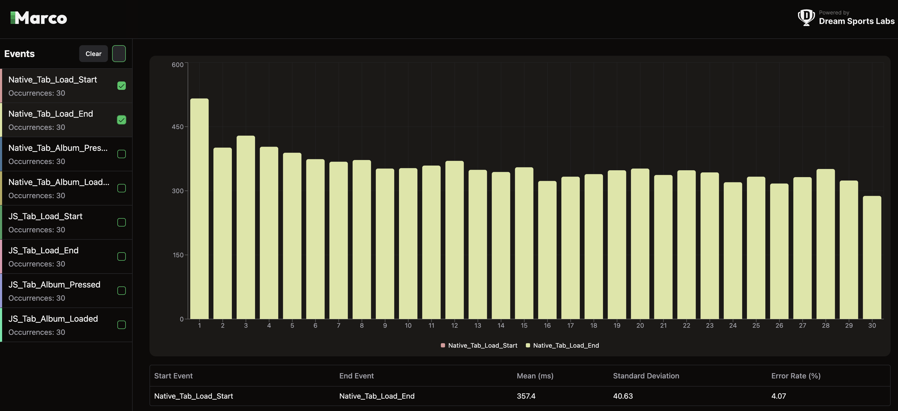
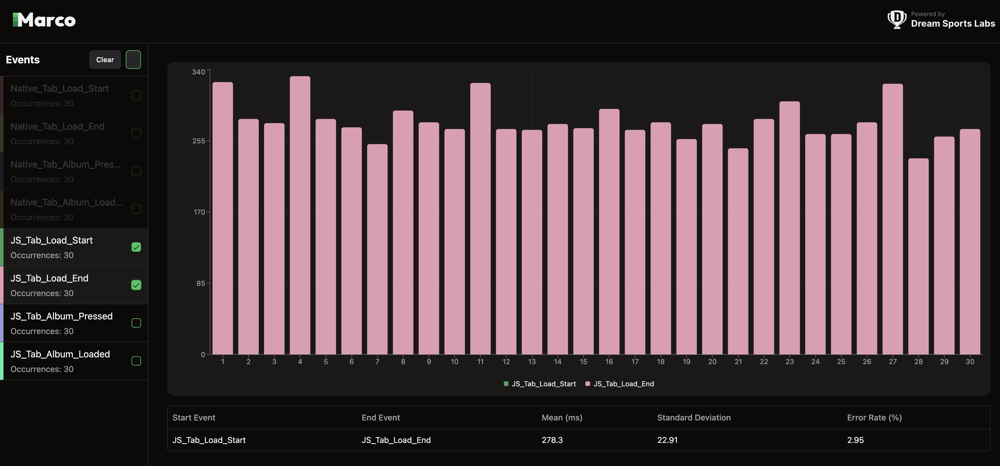
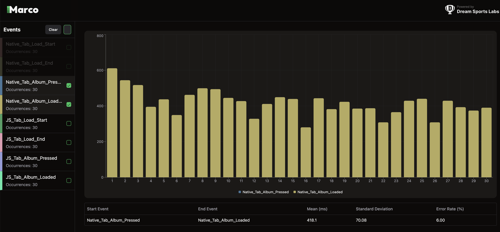
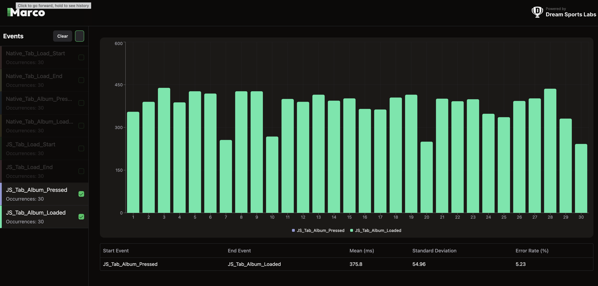

# RN BottomTab Benchmarks

This repository benchmarks [**Native Bottom Tabs**](https://okwasniewski.github.io/react-native-bottom-tabs/) against [**JS Bottom Tabs**](https://reactnavigation.org/docs/bottom-tab-navigator/) based on performance metrics such as load time and tab switch time. The **Native Bottom Tab** library, developed by [okwasniewski](https://github.com/okwasniewski), serves as the foundation for the native tab implementation. All benchmarking is conducted using a **Native Stack** implementation.

- **Load Time**: Time taken to load the initial screen when a bottom tab is opened.
- **Tab Switch Time**: Time taken to switch between tabs and display the next screen.

## About the Benchmarking Process 📝

We are using the **Marco** tool to mark events and CLI tools provided by Marco to visualize the results.

## Load Time ⌛

1. **Capture the Initial Event:**
   - The event is triggered when a button is clicked to open a bottom tab.
   - The `timestamp` is extracted from the `Pressable.onPress` event object.
   - The `timestamp` and a marker name are passed to the native module `PerformanceTracker.track()` to log the start time.

2. **Track Screen Rendering:**
   - The load time completes when the initial screen content is fully painted and visible.
   - We wrapped the **Article Screen** with the **PerformanceTracker** API from the **Marco** library.
   - This accurately captures the **onDraw** event, indicating when the screen is fully rendered.

### Load Time Comparison (Native vs JS)

| Metric        | Native Bottom Tabs | JS Bottom Tabs |
|--------------|------------------|------------------|
| Load Time (ms) | **X ms** | **Y ms** |





## Tab Switch Time 🔄

1. **Capture the Tab Press Event:**
   - The event is captured when a tab is pressed.
   - The `timestamp` is obtained from listeners attached to the `tabPress` event at the screen level.
   - This `timestamp`, along with a marker name, is sent to `PerformanceTracker.track()` to log the start of the tab switch action.

2. **Track New Screen Rendering:**
   - The tab switch time completes when the new screen content is fully rendered and visible.
   - We wrapped the **Album Screen** with the **PerformanceTracker** API from the **Marco** library.
   - This accurately captures the **onDraw** event, marking the end of the tab switch process and the benchmark.

### Tab Switch Time Comparison (Native vs JS)

| Metric        | Native Bottom Tabs | JS Bottom Tabs |
|--------------|------------------|------------------|
| Tab Switch Time (ms) | **X ms** | **Y ms** |





## How to Run the Benchmarks 🛠️

### Prerequisites

1. [React Native Environment Setup](https://reactnative.dev/docs/next/environment-setup)
2. [Maestro Setup](https://maestro.mobile.dev/)
   - To check if Maestro is installed on your system, run command:
   ```sh
   maestro --version
   ```

### Setup

```sh
git clone git@github.com:shubhaamgupta11/rn-tabs-benchmarks.git
cd rn-tabs-benchmarks
yarn install
```

### Create Release Build

```sh
yarn android --mode=Release
```

### Run the Benchmarks

```sh
yarn get:numbers:android <iteration_count>
```

This will run the iterations as mentioned in `src/scripts/automation/test.yaml`.

### Generate and Visualize Report

A configuration file, `marco.config.js`, contains default paths to store reports. We can configure them based on our needs.

```sh
yarn marco generate --platform android
```

```sh
yarn marco visualize --platform android
```

## Results

### Device Details
- **Low-end Android real device**
- **Vivo Y15 OS 12, RAM 3 GB**

The Marco snapshot is stored inside: `reports/android/pixel/log.json`.

To visualize it again, run:

```sh
yarn marco visualize --platform android
```

> **Ensure the correct `dataDir` path is set in `marco.config.js`**.

